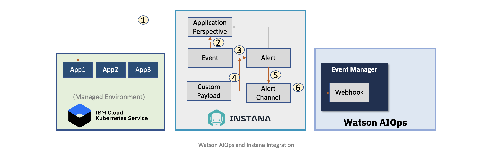

# Create Instana Webhook in Watson AIOps Event Manager (NOI)

This article explains about how to create Webhook in Watson AIOps Event Manager (NOI) Console to receive events from Instana.

The article is based on the the following.

- RedHat OpenShift 4.6.x / 4.7.x on IBM Cloud (ROKS)
- Watson AIOps 3.1.x



## Steps

1. In NOI UI, choose the menu `Adminstration > Integration with other systems` 


2. Click on `New Integration` button


3. Click on `configure` button in `Webhook` tile.


4. The below screen get displayed. Copy the URL displayed to notepad for later usage.

5. Copy and paste below json file in the `Example Incoming Request` section.

[files/example-incoming-request.json](files/example-incoming-request.json) 


6. Enter the below mandatory attributes

```
Severity    
severity 

Summary
summary

Resource name
details.customPayloads."custom:NodeAlias"[0]

Event type
resource.type
```


7. Click on `Optional event attributes`

You will have the below screen displayed.

8. Enter `Name` for the webhook

9. Select the below optional attributes

- Sender: Type
- Sender: Name
- Sender: Display name
- Resolution
- Resource: Source ID


10. Click on `Confirm selections` button.

You will have the below screen displayed. 

11. Click on `Optional event attributes` button below.


You will have the below screen displayed. 

12. Enter the below values for the option attributes.

```
Sender: Type
sender.name

Sender: Name
sender.name

Sender: Display name
sender.displayName

Resolution
resolution

Resource: Source ID
deduplicationKey
```


13. Click on `Save` button.

13. Instana webhook is created and displayed like the below. 


Now this webhook can receive events from Instana and send to Event Manager in Watson AIOps

## Next Step

Webhook is created here. 

You can configure `Applications`, `Events`, `Alerts` and etc to complete Instana with Watson AIOps Integration.

Prev : [Integrating Instana with Watson AIOps](../)

Next : [Create Application in Instana](../2-application)

Home : [Integrating Instana with Watson AIOps](../)


