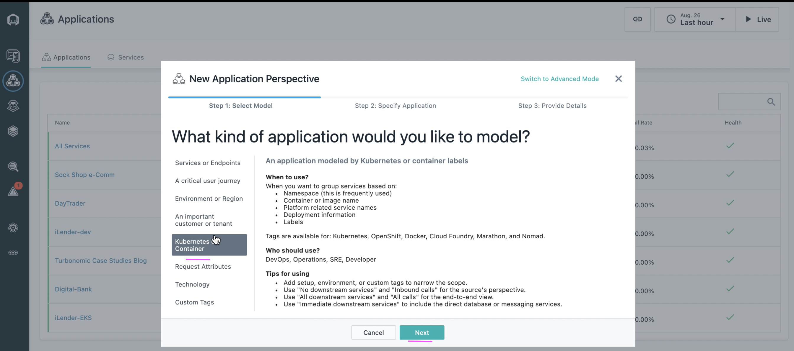

# Create Application in Instana

This article explains about how to create Application or Application Perspective in Instana.

## Pre-Requisite

- The `kubernetes based application` is deployed in an Openshift Container Platform or on Kubernetes Cluster.

- The `Instana agent` is deployed in the cluster.

- `Instana` is installed and already observing the cluster. 

## Objective

The Objective is to create Application Perspective for the kubernete based microservices application.

Here `iLender` application is deployed in `ilend-ns` namespace. 

Lets create Application Perspective  called `iLend`

## Steps

1. Click on `Application` in the left navigation menu.

2. Click on `Add` button in the bottom of the screen.

3. Click on `New Application Perspective` button.

4. Choose `Kubernetes or Container` menu 

5. Click on `Next` button.

6. Select `Kubernetes` option in the top.

7. Select `Kubernetes Namespace` option in the list box.

8. Select the namespace where your app is deployed. Here `ilend-ns` is the namespace. If your namespace is not listed here, try putting some load to the app.

9. Select  `All downstream` option.

10. Click on `Next` button.

11. Enter `Application Perspective Name`.

12. Select on `All Calls` Option.

13. Click on `Create` button.

14. Here is the application perspective screen for the app that you have created.

## Next Step

Application Perspective is created here. 

You can configure `Events`, `Alerts` and etc to complete Instana with Watson AIOps Integration.

Prev : [Create Instana Webhook in Watson AIOps Event Manager (NOI)](../1-webhook)

Next : [Create Custom Payload in Instana](../3-custom-payload)

Home : [Integrating Instana with Watson AIOps](../)

