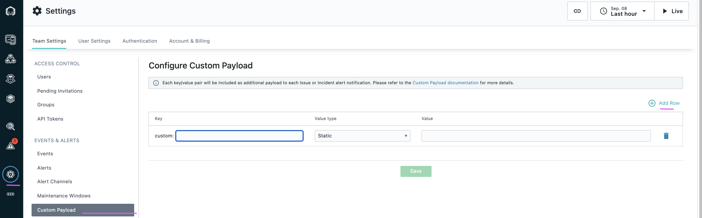
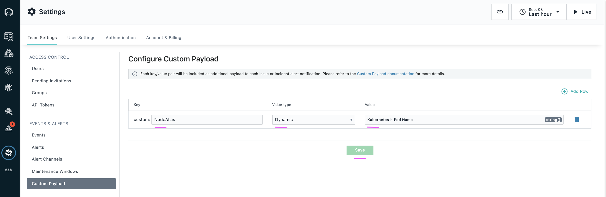

# Create Custom Payload in Instana

This article explains about how to create Custom Payload in Instana.


## Objective

The Objective is to create Custom Payload. By doing this whenever there is an alert send from the Instana to any alert Channels, the data could contain what is mentioned in the Custom Payload as well.

This helps the Instana to send additional info along with the alert data to the alert channels.

The custom payload would look like this. Look at the section `customPayloads`

```
{
    "details": {
    "containerNames": [],
    "customPayloads": {
      "custom:NodeAlias": [
        "ilender-creditscore-66d5886bd9-vl2xk"
      ]
    }
  },
  "deduplicationKey": "someId",
  
  "sender": {
    "name": "Instana",
    "displayName": "Instana Server",
    "sourceId": "someId",
    "type": "Instana"
  },
  "resource": {
    "sourceId": "someId",
    "type": "JVM",
    "displayName": "test",
    "hostname": "test.fqdn",
    "name": "test"
  },  
  "severity": "Warning",
  "summary": "Garbage Collection Activity High (11%)",

  "type": {
    "eventType": "JVM"
  }
}
```

## Steps

1. Choose the menu `Custom Payload` under the configuration section. 

2. Click on `Add Row` button. 



3. Enter the `Node Alias` in the field `Custom`. 

4. Choose  `Dynamic` in the field `value type`. 

5. Choose  `Kubernetes Pod Name` in the field `value`. 

6. Click on `Save` button. 



Now all the alerts send from this Instana would have Kubernetes Pod Name inside the alert data.

```
    "customPayloads": {
      "custom:NodeAlias": [
        "ilender-creditscore-66d5886bd9-vl2xk"
      ]
    }
```    


## Next Step

Custom Payload is created here. 

You can configure `Events`, `Alerts` and etc to complete Instana with Watson AIOps Integration.

Prev : [Create Application in Instana](../2-application)

Next : [Create Events in Instana](../4-event)

Home : [Integrating Instana with Watson AIOps](../)


