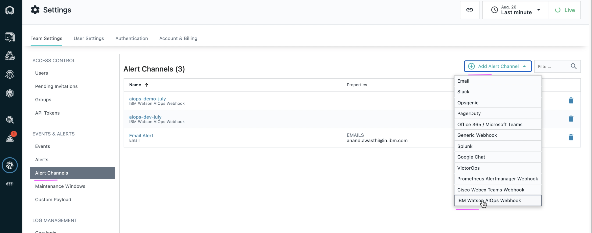
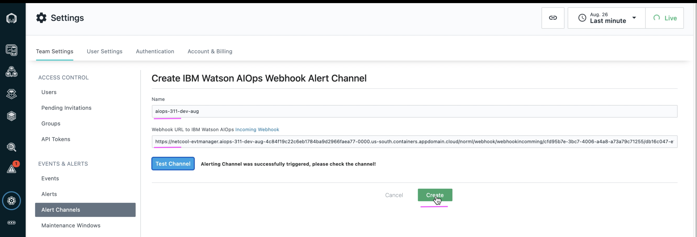
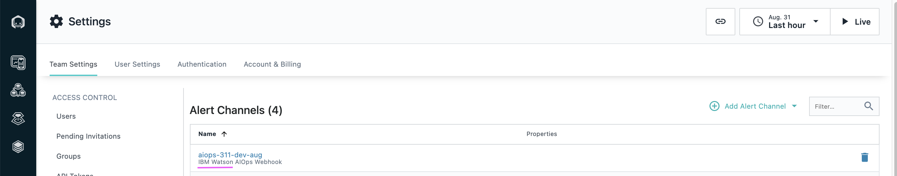

# Create Alert Channels in Instana

This article explains about how to create Alert Channels in Instana.

## Pre-Requisite

- A Webhook should have been created in `IBM Watson AIOps Event Manager (NOI)` to receive event alerts from Instana. The Webhook generated URL should have been noted and be available to use here.

## Objective

The Objective is to create Alert Channel that points to the Webhook in `IBM Watson AIOps Event Manager (NOI)`.

## Steps to create Alert Channel

1. Choose the menu `Alert Channels` under the configuration section. 

2. Choose the `Add Alert Channels` button on the right. 

3. Choose the `IBM Watson AIOps Webhook` option from the list. 

4. Enter the values for the below fields as shown in the screenshot. 

- Name
- WebHook URL

Here `WebHook URL` referes to the URL noted while creating the webhook `IBM Watson AIOps Webhook`  in `IBM Watson AIOps Event Manager (NOI)`.

5. Click on `Create` button. 

7. Alert channel is created and available as below. 

## Next Step

Alert Channel is created here. You can create `Alert` to complete Instana with Watson AIOps Integration.

Prev : [Create Events in Instana](../4-event)

Next : [Create Alert in Instana](../6-alert)

Home : [Integrating Instana with Watson AIOps](../)