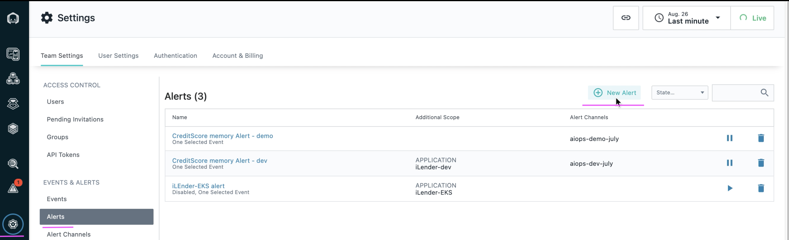
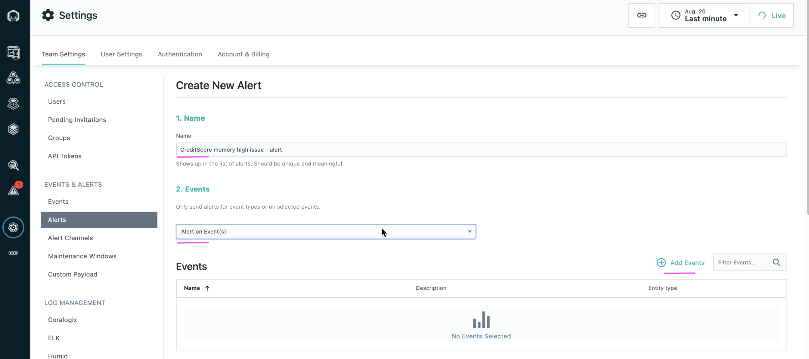
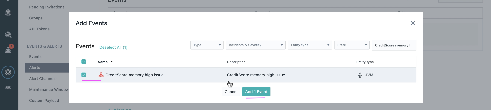
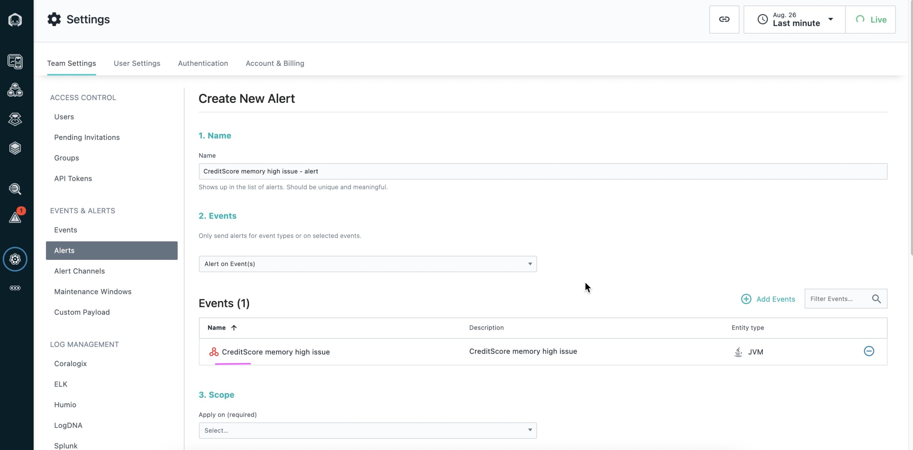
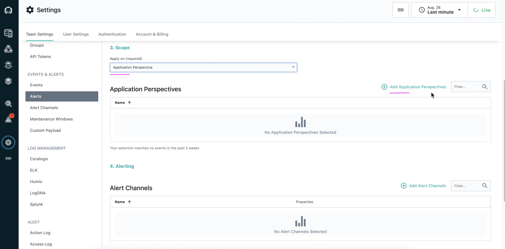
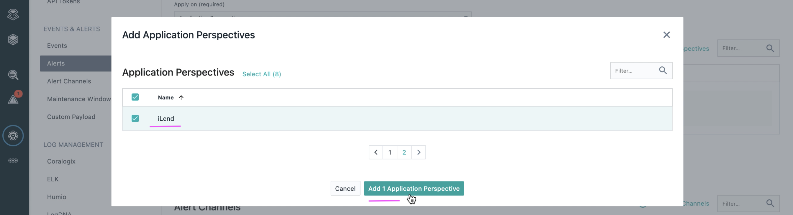
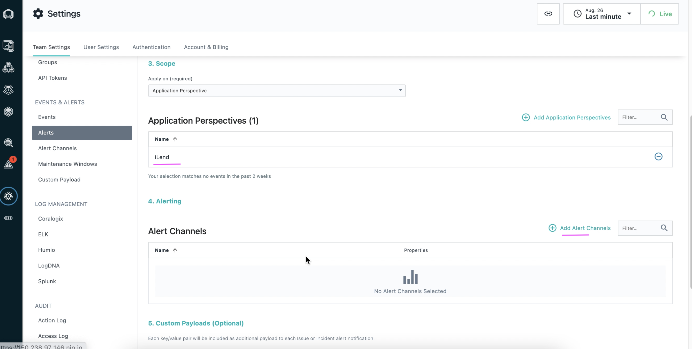
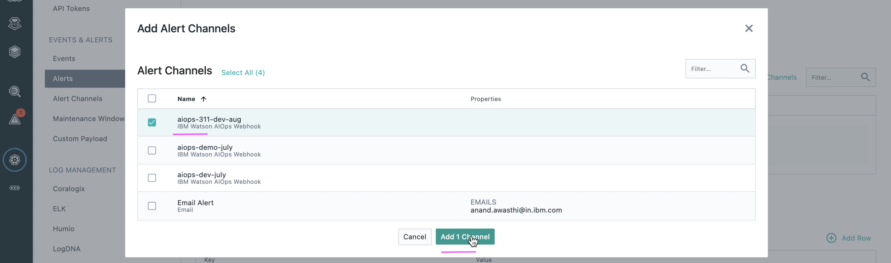
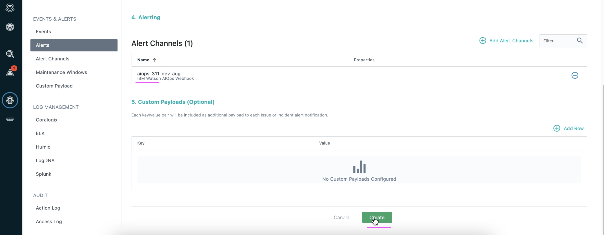
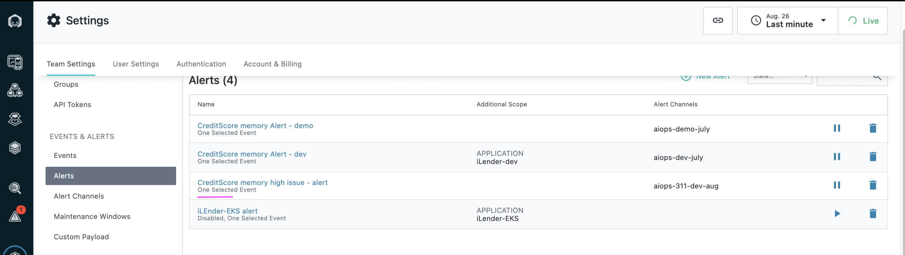

# Create Alerts in Instana

This article explains about how to create Alerts in Instana for the selected event.

## Pre-Requisite

- The `kubernetes based application` is deployed in an Openshift Container Platform or on Kubernetes Cluster.

- `Application Perspective` is already created in Instana for the above deployed application. 

- `Event` is already created in Instana for the above created Application Perspective. 

- `Alert Channel` is already created in Instana to send Alert to the `IBM Watson AIOps Webhook`

## Objective

The Objective is to create / configure Alert for the selected event.

- Application called `iLender` is deployed in `ilend-ns` namespace. 
- Application Perspective called `iLend` is already created and available in the Instana.
- Event called `CreditScore memory high issue` is configured when the `JVM memory usage` is more than `80%`.
- Alert Channel `IBM Watson AIOps Webhook` is created

- Alert called `CreditScore memory high issue - alert` pointing to above alert channel to be created

## Steps

1. Choose the menu `Alerts` under the configuration section. 

2. Click on `New Alert` button. 

3. Enter the values for the below fields as shown in the screenshot. 

- Name
- Events

4. Click on `Add Events` button. 

5. Choose the `CreditScore memory high issue` event. 

6. Click on `Add 1 Event` button. 

Event get added like the below.

7. Enter the values for the below fields as shown in the screenshot. 

- Apply On

8. Click on `Add Application Perspectives` button. 

9. Choose the `iLend` application perspective. 

10. Click on `Add 1 Application Perspectives` button. 

Application Perspective get added like the below.

11. Click on `Add Alert Channels` button. 

12. Choose the appropriate `Alert Channels` created. 

13. Click on `Add 1 Channel` button. 

Alert Channel get added like the below.

14. Click on `Create` button to create Alert. 

Alerts get created like the below.

## Next Step

Alert is created here. With this you have completed all the steps required to complete Instana with Watson AIOps Integration.

Prev : [Create Alert Channels in Instana](../5-alert-channel)

Home : [Integrating Instana with Watson AIOps](../)